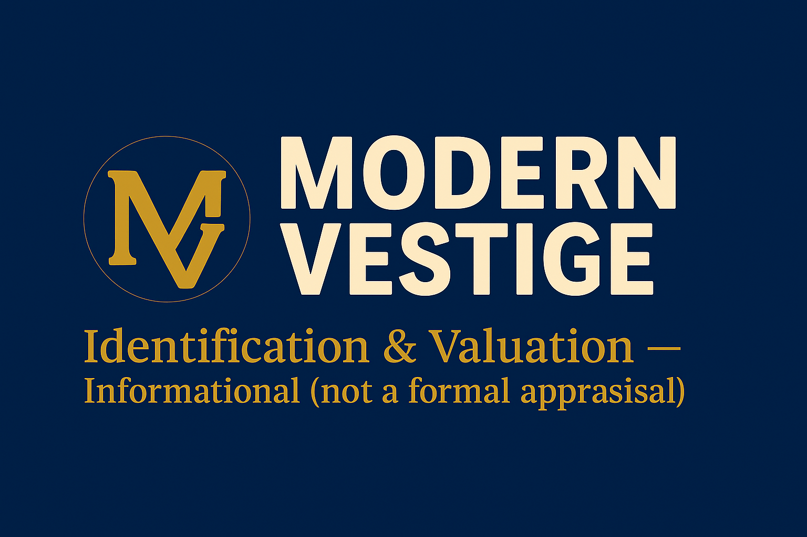

# 🏷️ Modern Vestige — Brand & Web Launch (v1.0)

## ✨ Overview
This release marks the official launch of the **Modern Vestige** website — a fully responsive, single-page showcase for unique vintage collectibles. Built for clarity, brand cohesion, and modern performance on Netlify.

---

## 🧱 Core Features

### 🎨 Brand Integration
- Added final logo, favicon, and banner assets using official Modern Vestige colors:  
  **Deep Navy (#1D3557)**, **Antique Gold (#E0B45C)**, and **Ivory (#F8F5F0)**.
- Updated visual hierarchy for a timeless, upscale aesthetic.

### 🖋️ Typography Refresh
- **Poppins** for headings (modern with classic curves)
- **Inter** for body text (clean, legible, versatile)

### 🔍 SEO & Meta Enhancements
- Integrated OpenGraph and Twitter meta tags for better visibility on social media.
- Added structured JSON-LD schema markup for Google search.
- Included a social preview image (`social-preview.jpg`) for link sharing.

### 🧩 UI/UX Improvements
- New header with branded logo and responsive navigation.
- Hero section redesigned using `banner elements.png`.
- Enhanced spacing, consistent line-heights, and mobile responsiveness.
- Simplified footer and improved contact layout.

### 🖼️ Assets Added
```
assets/mv_logo_main.png
assets/banner elements.png
assets/mv_profile_icon.png
assets/social-preview.jpg
assets/favicon.png
```

---

## 🚀 Deployment
Deployed via **Netlify** with continuous integration from the GitHub repository.

**Repository:** [batkins33/mv-website](https://github.com/batkins33/mv-website)  
**Production URL:** [https://modernvestige.com](https://modernvestige.com)

---

## 🧭 Next Steps
- Add eCommerce functionality (Shopify or Snipcart integration)
- Set up form handling via Netlify Forms or a lightweight backend
- Add analytics tracking (Google Analytics 4 or Plausible)
- Optimize SEO keywords for niche categories (e.g. vintage signage, toys, mid-century decor)

---

## 📅 Version Info
**Version:** v1.0.0  
**Release Date:** October 2025  
**Maintainer:** [B. Atkins](https://github.com/batkins33)

---

## 📸 Brand Snapshot


> “Preserving the beauty of the past — one collectible at a time.”
